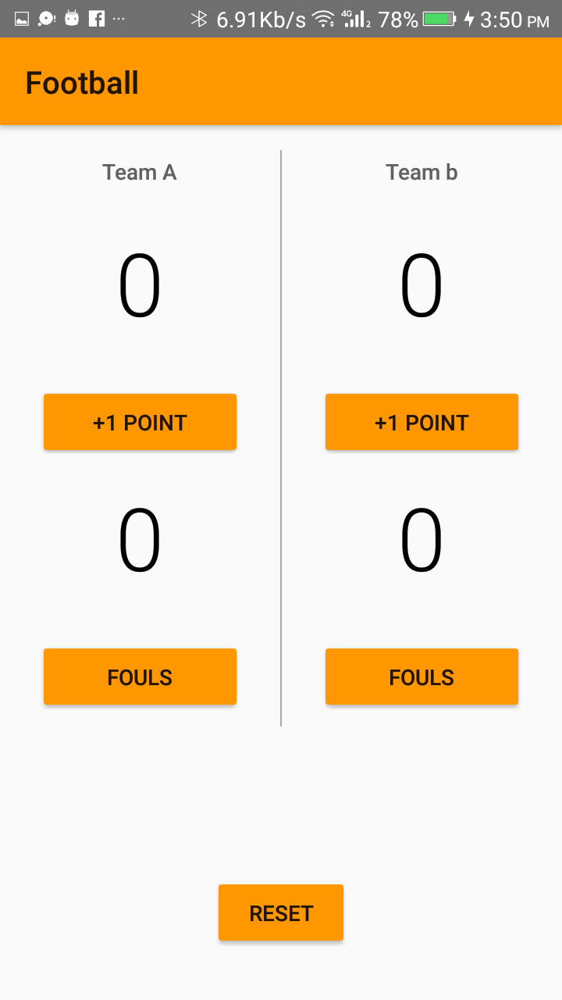

# Football-Score-Keeper-App
The goal is to create a Score Keeper app which gives a user the ability to keep track of the score of two different teams playing a game of my choice. I have chosen American Football:
## What will I learn?
This project is about combining various ideas and skills we’ve been practicing throughout the course. They include:

    Adding button code to your app
    Updating views
    Properly scoping variables
    Finding views by their ID
## Screenshots
 
